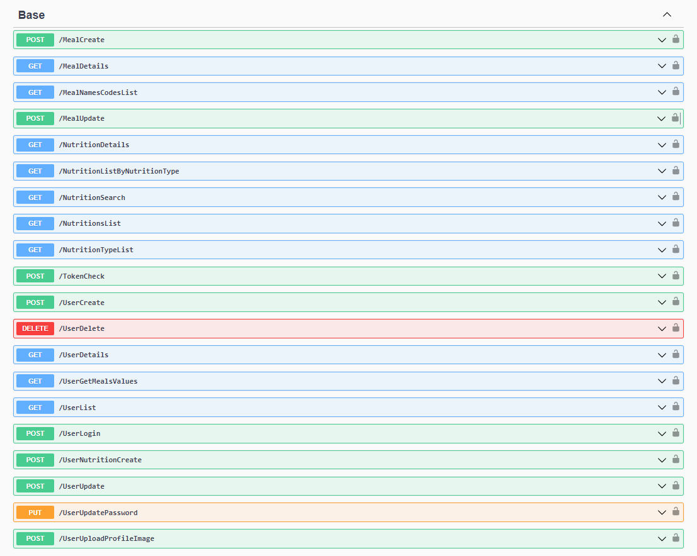

[Demo]: https://www.youtube.com/watch?v=z5Ad3D7VYT4
[Linkedin]: https://www.linkedin.com/company/techrose/

<p align="center">

[Demo] 
[Linkedin]

</p>

<h1 style="margin-top: 20px;" align="center">Techrose Diabetes API</h1>
<h2 style="border-bottom: none;">Content</h2>
<ul>
    <a href="#about-project-content"><li>About project</li></a>
    <a href="#system-architecure"><li>System architecure</li></a>
    <a href="#getting-started"><li>Getting started</li></a>
    <a href="#contributing"><li>Contributing</li></a>
    <a href="#authors"><li>Authors</li></a>
</ul>
<div id="#about-project-content" style="margin-top: 20px;">
    <hr />
    <div>
        <h2 style="text-align: center; border-bottom: none;">About project</h2>
        <div class="">
            <p>The Techrose Diabetes Monitoring Application addresses the fundamental challenges in diabetes management by providing an innovative solution for the effective tracking and management of health data. Monitoring blood sugar levels using traditional methods can be time-consuming and prone to errors. This difficulty can make it challenging for diabetes patients to manage their health data accurately, potentially impacting health outcomes negatively. However, the Techrose Diabetes Monitoring Application allows users to record their daily sugar measurements, dietary habits, physical activities, and other important health indicators on a smart platform. This enables users to easily track their health data and receive personalized recommendations through in-depth analysis. The application can demonstrate improvements in diabetes management through regularly monitored health outcomes. The impact of the solution can be tracked through user feedback and data analysis tools, aiming to enhance users' quality of life and improve health outcomes. In this regard, the Techrose Diabetes Monitoring Application stands out as a reliable tool to ease the lives of diabetes patients and enhance health outcomes.</p>
            
            <div style="text-align: center;"><i>Techrose API Swagger Docs.</i></div>
        </div>
    </div>
</div>
<div style="margin-top: 20px;" id="system-architecure">
    <hr />
    <div>
        <h2 style="text-align: center; border-bottom: none;">System architecure</h2>
    </div>
    <div>
        We have selected specific products and platforms to implement our components, including React Native, .NET Core 8, MSSQL Server, and Google Cloud. .NET Core 8 is used to create an API for the application, ensuring fast and reliable data delivery to users. .NET Core offers robust performance and a wide developer ecosystem. MSSQL Server manages the database management of the application, ensuring secure and efficient data storage. Google Cloud is specifically used for storing photos. Google Cloud Storage simplifies photo storage and management processes, providing a scalable infrastructure.
    </div>
    <div>
        The scaling piece to a broader audience, we are planning to expand and scale our architecture with containerization technologies. Performance operations can be achieved with load balancing techniques. We can increase the deployability and scalability of microservice architecture. This allows each service to be scaled as needed. By increasing cache storage, you can keep frequently accessed data in cache, thereby reducing data storage. You can also create a more efficient system by optimizing your data storage strategies.
    </div>
</div>
<div style="margin-top: 20px;" id="getting-started">
    <hr />
    <div>
        <h2 style="text-align: center; border-bottom: none;">Getting started</h2>
    </div>
    <h4>Requirements</h4>
    <div>
        <ul style="list-style-type: decimal;">
            <li style="margin-top: 5px"> 
                <b>.NET Core SDK:</b> Required for developing and running .NET Core projects.
            </li>
            <li style="margin-top: 5px">
                <b>Visual Studio IDE or Visual Studio Code:</b> You can use either of these for project development. Visual Studio Community Edition is free and sufficient for developing and running the project.
            </li>
            <li style="margin-top: 5px">
                <b>Microsoft SQL Server:</b> Required for hosting the project's database. You can use the free Express Edition. You can download it from this link.
            </li>
            <li style="margin-top: 5px">
                <b>Google Cloud Platform (GCP) Account:</b> If the project utilizes services like Google Cloud Storage, you'll need a GCP account to create API keys and access. You can create an account and manage API access from here.
            </li>
        </ul>
    </div>
    <h4>Installation</h4>
    <div>
        <ul style="list-style-type: decimal;">
            <li style="margin-top: 5px"> 
                Clone or fork the project repository from GitHub.
            </li>
            <li style="margin-top: 5px">
                Open Visual Studio IDE or Visual Studio Code and navigate to the project folder.
            </li>
            <li style="margin-top: 5px">
                Open the Package Manager Console and run the following command to create migrations for the database:
            </li>
        </ul>
    </div>
    <h4>Migrations</h4>
    <div>
        <ul style="list-style-type: decimal;">
            <li style="margin-top: 5px;"> 
                Apply the migrations to the database by running the following command:
            </li>
            <div style="margin-top: 15px;">
                <pre><code>dotnet ef database update</code></pre>
            </div>
            <li style="margin-top: 5px">
                Add API keys and credentials for services like Google Cloud Storage and Firebase.
            </li>
            <li style="margin-top: 5px">
                Open a terminal or command prompt in the project folder and run the following command to start the project:
            </li>
            <div style="margin-top: 15px;">
                <pre><code>dotnet run</code></pre>
            </div>
            <li style="margin-top: 5px">
                Visit <b>http://localhost:5194</b> in your web browser to access your local copy of Techrose API.
            </li>
        </ul>
    </div>
</div>
<div style="margin-top: 20px;" id="contributing">
    <hr />
    <div>
        <h2 style="text-align: center; border-bottom: none;">Contributing</h2>
    </div>

1. **Fork the Repository:**
- Click on the "Fork" button in the top right corner of the project's main page to create a copy of the project in your GitHub account.

2. **Clone the Copied Repository to Your Machine:**
   - Clone the repository to your machine using the following command in the terminal or command prompt:
     ```bash
     git clone https://github.com/your-username/project-name.git
     ```

3. **Create a New Branch:**
   - Create a new branch to track your changes:
     ```bash
     git checkout -b new-feature
     ```

4. **Make Changes:**
   - Make your code edits, additions, or updates.
   - Make changes step by step, logically, and comprehensibly.

5. **Commit Changes:**
   - Commit your changes:
     ```bash
     git add .
     git commit -m "Descriptive message about your changes"
     ```

6. **Push to the Forked Repository:**
   - Push the changes in your new branch to the forked repository:
     ```bash
     git push origin new-feature
     ```

7. **Open a Pull Request (PR):**
   - Go to the main page of your repository on GitHub.
   - Click on the "Pull Requests" tab and create a new pull request by clicking the "New Pull Request" button to propose your changes to the original project.
   - Provide information in the description about the changes you made and why.

8. **Code Review and Progress:**
   - Your changes will be reviewed and discussed by the project owners or other contributors.
   - If everything is satisfactory and your changes are accepted, the pull request will be merged, and your contributions will be added to the project.
</div>
<div style="margin-top: 20px;" id="system-architecure">
    <hr />
    <div>
        <h2 style="text-align: center; border-bottom: none;">Authors</h2>
    </div>
    Techrose Developers Team
</div>